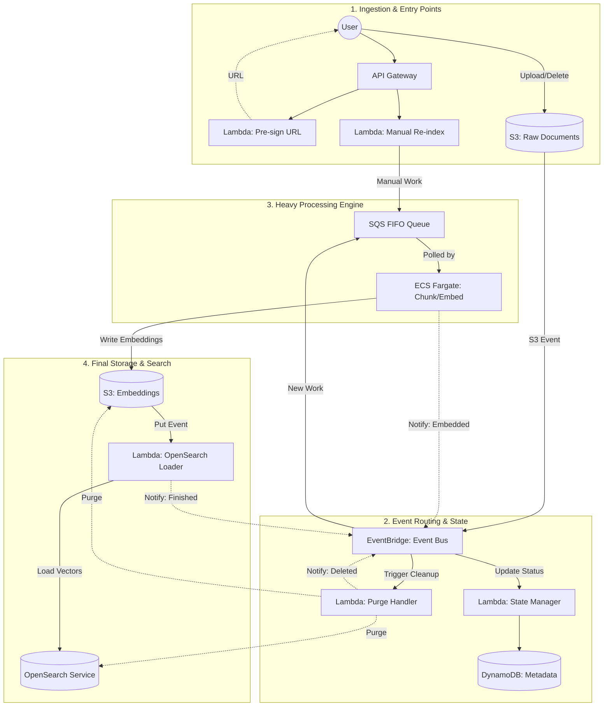

# Serverless Event-Driven RAG Indexing Pipeline

An asynchronous, highly-scalable indexing pipeline for Retrieval-Augmented Generation (RAG) built on AWS. This architecture leverages a "Scale-to-Zero" compute model and a centralized event bus to handle document ingestion, chunking, embedding generation, and vector indexing.

---

## 🏗 Architecture

The system uses **Amazon EventBridge** as the central nervous system, ensuring all components are decoupled and react to document lifecycle events.

---

## 🚀 Key Features

### 1. Event-Driven Orchestration
Everything flows through **Amazon EventBridge**. This allows for a modular design where the State Manager, Processing Engine, and Cleanup Logic operate independently based on standardized JSON events containing `documentid`, `customerid`, and `operationtype`.

### 2. "Scale-to-Zero" Processing
Heavy computational tasks (chunking and embedding) are handled by **ECS Fargate** instead of Lambda to avoid timeout limits and manage large files.
* **SQS FIFO Queue:** Ensures that documents are processed in the exact order they were uploaded.
* **Auto-Scaling:** The ECS cluster scales based on SQS `ApproximateNumberOfMessagesVisible` and the age of the oldest message, ensuring zero costs when idle.

### 3. Versioning & Manual Re-Indexing
The pipeline supports multiple embedding versions for the same source document.
* **API Trigger:** Users can call a dedicated endpoint with a `versionid` to re-process an existing document.
* **Sequential Integrity:** Manual requests are injected into the same FIFO queue, ensuring that if a user uploads and then immediately re-indexes, the operations stay in order.

### 4. Soft Delete Pattern
* When a document is deleted from the Raw S3 bucket, a `L_Delete` Lambda is triggered.
* It purges the associated vector data in **OpenSearch** and the chunk files in the **Embeddings S3**.
* It updates the **DynamoDB** record to `status: DELETED` rather than removing the entry, preserving a historical audit trail.

---

## 🛠 Tech Stack

| Service | Role |
| :--- | :--- |
| **API Gateway** | REST Interface for Pre-signed URLs and Re-indexing. |
| **AWS Lambda** | Event handling, state management, and lightweight indexing logic. |
| **Amazon S3** | Dual-bucket strategy (Raw source vs. Processed embeddings). |
| **Amazon EventBridge** | Serverless event bus for component decoupling. |
| **SQS FIFO** | Guaranteed ordering and deduplication of processing jobs. |
| **ECS Fargate** | Dockerized chunking and embedding generation. |
| **Amazon OpenSearch** | Vector database for RAG retrieval. |
| **DynamoDB** | NoSQL state store for document metadata and versioning. |

---

## 📋 Data Flow Details

### Ingestion & Processing
1. **Upload:** User gets a pre-signed URL via Lambda and uploads to `S3_Raw`.
2. **Event:** S3 triggers an event to the Event Bus.
3. **Queue:** The Bus routes the event to `SQS FIFO`.
4. **Compute:** ECS Fargate polls SQS, chunks the document, generates embeddings using langchain adapter for all embedding providers, and saves to `S3_Embeddings`.
5. **Index:** The `S3_Embeddings` put-event triggers a final Lambda to bulk-load vectors into `OpenSearch`.

### State Transitions
The `L_State` Lambda updates DynamoDB across the lifecycle:
`UPLOADED` ➔ `PROCESSING` ➔ `EMBEDDED` ➔ `FINISHED` (or `DELETED`).

---

## 🛡 Security & Compliance
* **Least Privilege:** All Lambda and ECS roles are scoped to specific S3 prefixes and DynamoDB keys.
* **Isolation:** Customer data is partitioned in S3 and DynamoDB using `customerid` as a partition key.
* **Auditing:** EventBridge history and DynamoDB state tracking provide a full lifecycle log of every document.
